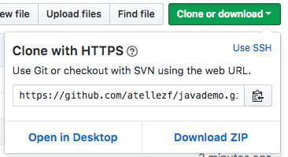

# JavaDemo
> Proyecto de la materia Programación Orientada a Objetos
- - - -
### OPCIÓN #1: Descarga en formato zip
* Para descargarlo en formato zip, puedes hacerlo mediante el botón ::Clone or Download::,.


- - - -
### OPCIÓN #2: Descarga mediante git clone
* Si tienes instalado [git](https://git-scm.com), como control de versiones en tu equipo de desarrollo,
```
$ git clone https://github.com/atellezf/javademo.git
Cloning into 'javademo'...
remote: Counting objects: 52, done.
remote: Compressing objects: 100% (22/22), done.
remote: Total 52 (delta 5), reused 31 (delta 5), pack-reused 20
Unpacking objects: 100% (52/52), done.
$
```
- - - -

### IDE UTILIZADO
* Para abrir el proyecto puedes utilizar cualquier IDE como [NetBeans](http://netbeans.apache.org/), [Eclipse](http://www.eclipse.org/downloads/) o [IntelliJ IDEA](https://www.jetbrains.com/idea/download), al momento de creación del proyecto inicial se utilizó NetBeans, el cual puedes descargar dando click en el logotipo,

    [](http://netbeans.apache.org/)
 